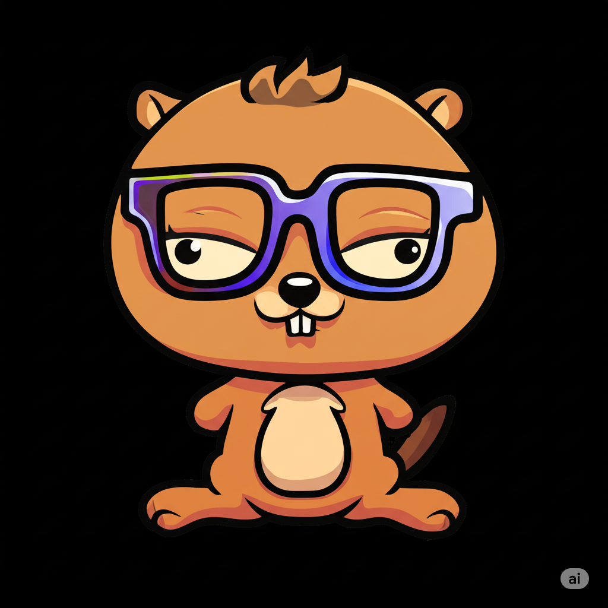

# shadcn-gomponents



[](https://pkg.go.dev/github.com/rizome-dev/shadcn-gomponents)

A Go implementation of shadcn/ui components using the [gomponents](https://github.com/maragu/gomponents) library.

This project provides a collection of beautifully designed, accessible UI components implemented in pure Go. It follows the same design principles and styling as [shadcn/ui](https://ui.shadcn.com/) but leverages Go's type safety and the gomponents library for HTML generation.

## Installation

```bash
go get github.com/rizome-dev/shadcn-gomponents
```

## Quick Start

Create a simple web application with shadcn-gomponents:

```go
package main

import (
    "log"
    "net/http"
    
    g "maragu.dev/gomponents"
    . "maragu.dev/gomponents/html"
    
    "github.com/rizome-dev/shadcn-gomponents/components/alert"
    "github.com/rizome-dev/shadcn-gomponents/components/button"
    "github.com/rizome-dev/shadcn-gomponents/components/card"
    "github.com/rizome-dev/shadcn-gomponents/components/badge"
)

func main() {
    // Create a simple page handler
    http.HandleFunc("/", func(w http.ResponseWriter, r *http.Request) {
        page := HTML(
            Head(
                Meta(Charset("UTF-8")),
                Meta(Name("viewport"), Content("width=device-width, initial-scale=1.0")),
                TitleEl(Text("My Shadcn-Gomponents App")),
                Link(Rel("stylesheet"), Href("/styles/app.css")),
            ),
            Body(Class("min-h-screen bg-background p-8"),
                Div(Class("container mx-auto max-w-4xl space-y-8"),
                    // Header
                    H1(Class("text-4xl font-bold mb-8"), Text("Welcome to Shadcn-Gomponents")),
                    
                    // Alert component
                    alert.New(alert.Props{
                        Variant: "default",
                    }, 
                        alert.Title("Heads up!"),
                        alert.Description("You can use these beautiful components in your Go web apps."),
                    ),
                    
                    // Card with content
                    card.Root(
                        card.Header(
                            card.Title("Dashboard"),
                            card.Description("Your application overview"),
                        ),
                        card.Content(
                            Div(Class("flex gap-4 mb-4"),
                                badge.New(badge.Props{Variant: "default"}, Text("Active")),
                                badge.New(badge.Props{Variant: "secondary"}, Text("v1.0.0")),
                                badge.New(badge.Props{Variant: "outline"}, Text("Go 1.24")),
                            ),
                            P(Class("text-muted-foreground"),
                                Text("Build beautiful, type-safe UI components with Go and Tailwind CSS."),
                            ),
                        ),
                        card.Footer(Class("flex gap-2"),
                            button.New(button.Props{
                                Variant: "default",
                                Size: "sm",
                            }, Text("Get Started")),
                            button.New(button.Props{
                                Variant: "outline", 
                                Size: "sm",
                            }, Text("Learn More")),
                        ),
                    ),
                ),
            ),
        )
        
        page.Render(w)
    })
    
    // Serve static files (CSS)
    http.Handle("/styles/", http.StripPrefix("/styles/", http.FileServer(http.Dir("./public/styles"))))
    
    // Start server
    log.Println("Server starting on http://localhost:8080")
    log.Fatal(http.ListenAndServe(":8080", nil))
}
```

### Running the Example

1. Create the project structure:
   ```bash
   mkdir myapp && cd myapp
   go mod init myapp
   go get github.com/rizome-dev/shadcn-gomponents
   ```

2. Copy the Tailwind CSS file:
   ```bash
   mkdir -p public/styles
   # Copy the compiled CSS from the library or build your own
   ```

3. Run the application:
   ```bash
   go run main.go
   ```

4. Open http://localhost:8080 in your browser

### Full Demo Application

For a complete example with all 40+ components, check out the demo application:

```bash
git clone https://github.com/rizome-dev/shadcn-gomponents
cd shadcn-gomponents
make start  # Builds CSS and runs the demo
```

Visit http://localhost:8080 to see all components in action.

## Components

### Layout
- [x] Aspect Ratio
- [x] Card
- [x] Collapsible
- [x] Resizable
- [x] Scroll Area
- [x] Separator
- [x] Sidebar

### Forms
- [x] Button
- [x] Checkbox
- [x] Form
- [x] Input
- [x] Input OTP
- [x] Label
- [x] Radio
- [x] Selector
- [x] Slider
- [x] Switch
- [x] Textarea
- [x] Toggle
- [x] Toggle Group

### Display
- [x] Alert
- [x] Alert Dialog
- [x] Avatar
- [x] Badge
- [x] Calendar
- [x] Carousel
- [x] Chart
- [x] Progress
- [x] Skeleton
- [x] Table
- [x] Toast

### Navigation
- [x] Accordion
- [x] Breadcrumb
- [x] Command
- [x] Context Menu
- [x] Dialog
- [x] Drawer
- [x] Dropdown Menu
- [x] Hover Card
- [x] Menubar
- [x] Navigation Menu
- [x] Pagination
- [x] Popover
- [x] Sheet
- [x] Tabs
- [x] Tooltip

### Feedback
- [x] Sonner (Toast notifications)

## License

MIT License - see LICENSE file for details.

## Credits

- Design and styling from [shadcn/ui](https://ui.shadcn.com/)
- Built with [gomponents](https://github.com/maragu/gomponents)
- Developed by [rizome labs](https://rizome.dev)
